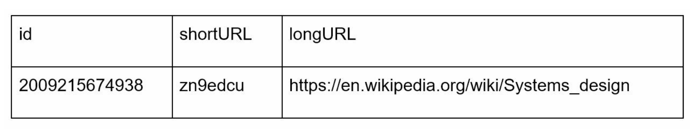
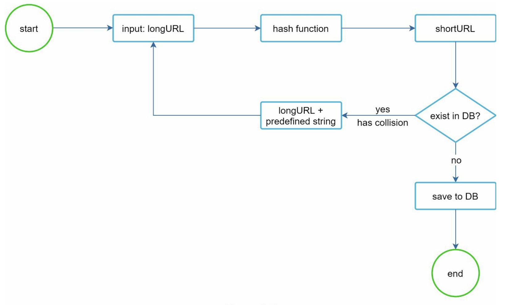
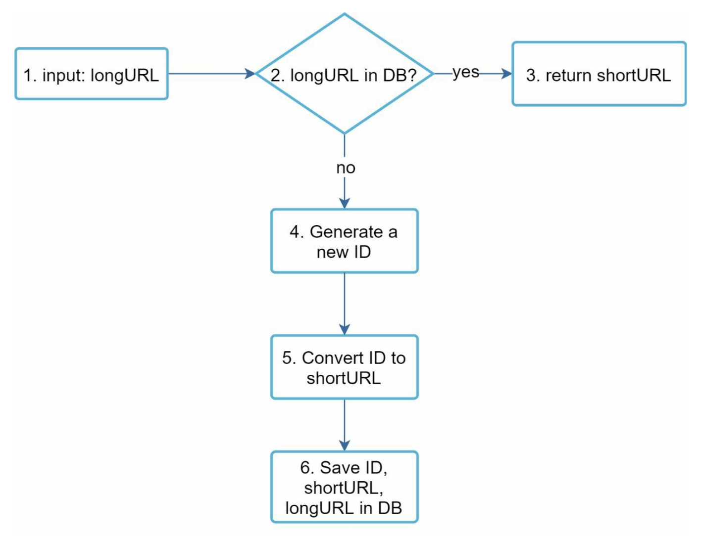
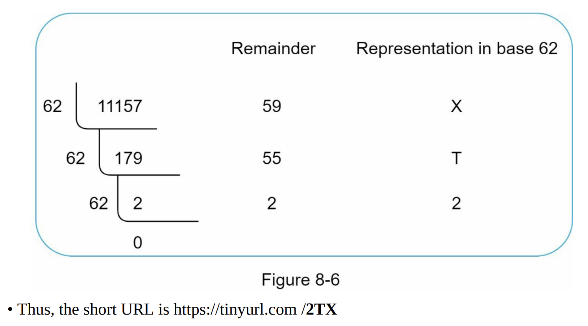
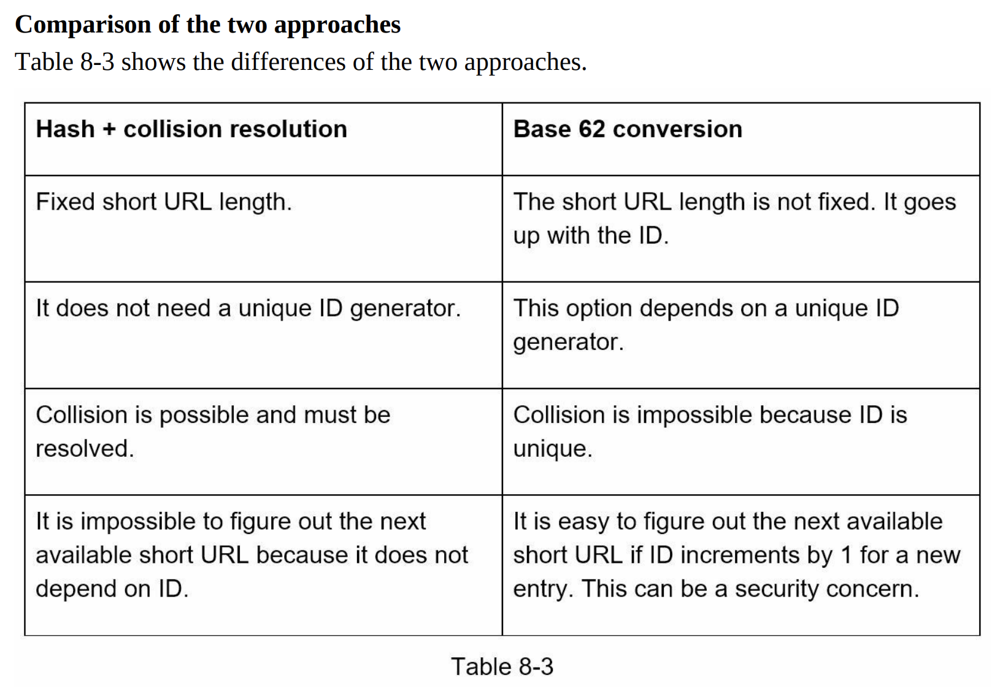
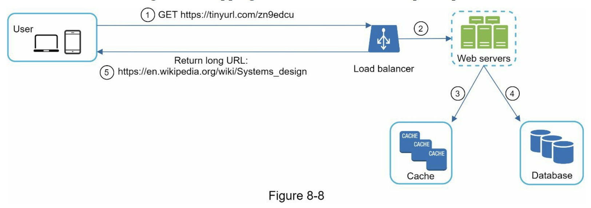

# 第八章：設計短網址生成器

## 前言

本篇會介紹如何設計一短網址生成器，主要探討 hash 映射函數的設計（for URL shortening）以及從短網址拿到完整網址後的 URL 重導向（redirecting）

## 步驟一：需求範圍確認

Q: 可以舉個例子說明此短網址服務的運作嗎

A: 假設 https://www.systeminterview.com/q=chatsystem&c=loggedin&v=v3&l=long 為原始網址，此服務會創建一縮短版本（alias），如 https://tinyurl.com/y7keocwj ，如點擊此 alias，會將你重導向至原始網址

Q: 服務要支援多大流量規模

A: 每天 100 million 個網址

Q: 短網址長度是否有限制

A: 越短越好

Q: 生成的短網址是否有符號限制

A: 需全為數字或英文（0-9 & a-z & A-Z）

Q: 短網址是否可被刪除或更新

A: 可假設不會被刪除或更新

### 需求總結

1. URL shortening：給一長網址 -> 回傳短網址
2. URL redirecting：給一短網址 -> 回傳長網址並重導向
3. 高可用性、擴展性、錯誤容許

### 系統規格估算

- 寫入量：100 million 個網址 / 日

- 每秒寫入量：100 million / 24 / 3600 = 1160

- 讀取量：假設讀寫比為 10 : 1，每秒讀取量為 1160 * 10 = 11,600

- 假設此服務會運作 10 年，總網址量為 100 million * 365 * 10 = 365 billion

- 假設平均一個網址長度為 100 bytes

- 10 年的規格上限為 365 billion * 100 bytes * 10 years = 365 TB

## 步驟二：high-level 架構

### API Endpoints

1. URL shortening

REST API 範例如：

<code>
POST api/v1/data/shorten

- request parameter: {longUrl: longURLString}
- return shortURL
</code>

假設縮短後的網址格式如："www.tinyurl.com/{hashValue}"，我們需設計一 hash 函數來將長網址對應成短網址，需符合兩條件

- 每一長網址對應唯一的短網址字串（即上面的 hashValue）
- 每一 hashValue 可對應回去長網址

2. URL redirecting

REST API 範例如：

<code>
GET api/v1/shortUrl

- Return longURL for HTTP redirection
</code>

重導向流程可見下圖

301 vs 302 重導向

301 為永久轉址，302 為暫時轉址，如果想減少伺服器負擔，用 301，因為能 cache 在瀏覽器端，不會再向短網址伺服器發送請求；但如果 analytics 很重要，用 302，因為有經過短網址伺服器才能追蹤流量、分析行銷成效等等

## 步驟三：深入探討

### 資料結構

### hash 函數（for URL shortening）

選擇合適的 hash 函數前，我們需要先估算 hashValue 的最小長度，每一 hashValue 裡的字元可為 [0-9, a-z, A-Z]，有 10 + 26 + 26 = 62 個選項，因上限的總網址量為 365 billion 筆，hashValue 的最小長度為 minimum n that can make 62^n ≥ 365 billion，可算出 n = 7 時可符合條件，因此 hashValue 的最小長度為 7

兩種設計 hash 函數的方法：

1. well-known hash functions + 碰撞處理
2. Base 62 conversion

#### well-known hash functions + 碰撞處理

用知名的 hash 演算法，如 CRC32、MD5、SHA-1...，缺點為 hash 出來的字串太長，以及還需要向資料庫確認是否有碰撞，會降低效能，一個提高檢查效率的改進方式為 bloom filter，雖有可能產生 false positive，但在此應用情境下可容忍

#### Base 62 conversion

先根據章節 7 的唯一 ID 生成器生出純數字 UUID 後，將之轉為 62 進位，如得到的 UUID 為 11,157，對應的 62 進位算法為：

兩個方法的比較表

### URL 重導向（redirecting）

## 步驟四：總結

延伸可討論的點：

- Rate limiter：避免惡意使用者灌爆服務，見第四章筆記

- Web server scaling：因為此服務不需紀錄狀態，所以 web server 可輕易 auto-scale

- Database scaling：Database replication and sharding

- Analytics：結合分析工具來收集點擊量、何時點擊、轉化率等等商業面需要知道的數據，除了上述提到的讓流量經過短網址伺服器時收集，加入分析工具後也會讓網址變很長（UTM tracking），這時短網址服務就更重要了

- Availability, consistency, and reliability，見第一章筆記